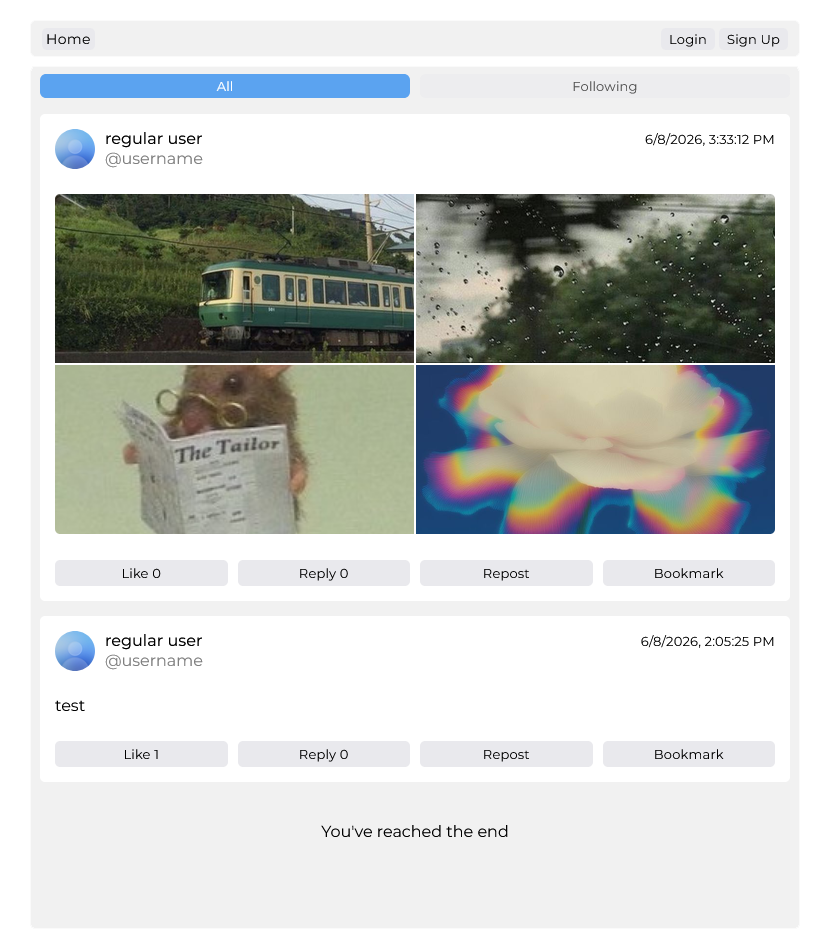

## Openfeed


Open source social media platform. Uses Express.  

Uses Nunjucks for both SSR and CSR, to be honest I don't know how the project ended up with this setup but it works well and is fast. 

#### Features:  
- Infinite scrolling
- Media uploads with mimetype validation
- User profiles and profile customization
- Different types of feeds, eg. likes, bookmarks, following.

<br>

<p align="center">
  
</p>

## Installation:  
Development
``` 
git clone https://github.com/ccloverdev/social_media_demo.git
```
```
npm build && npm run dev
```


